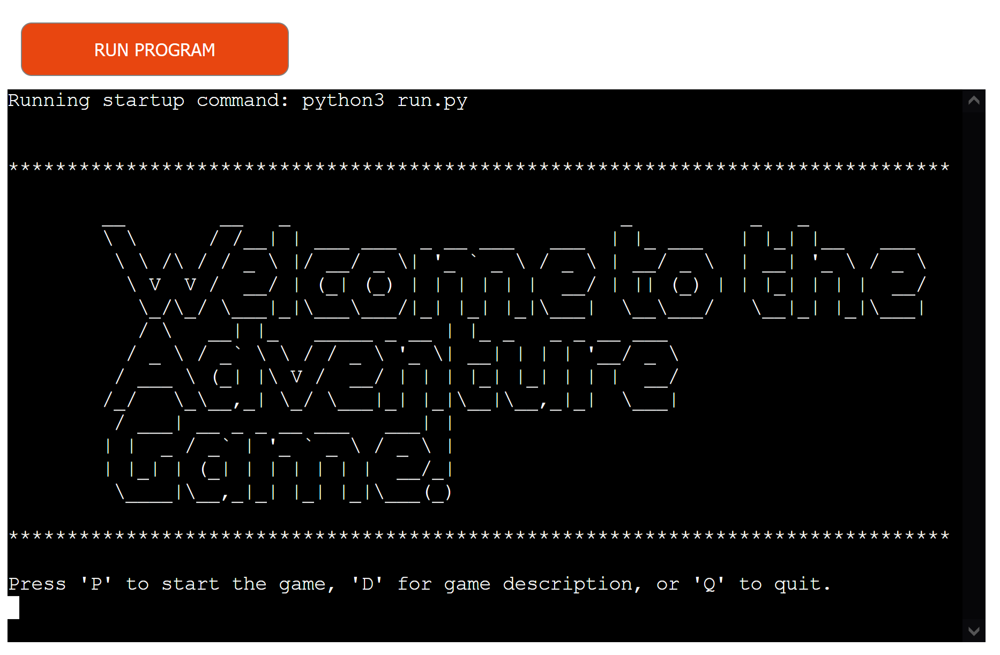
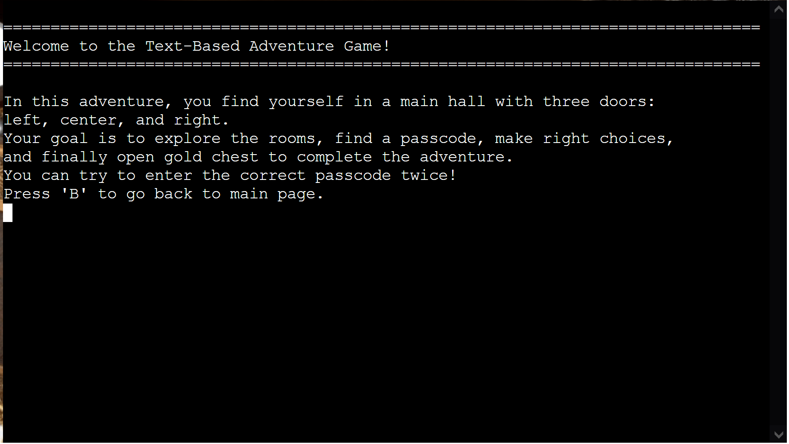
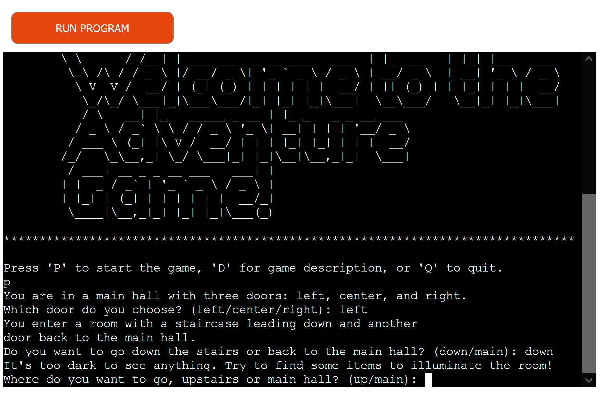
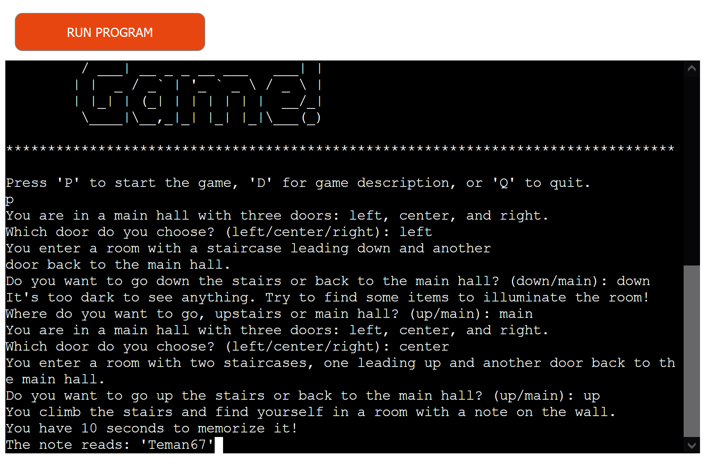
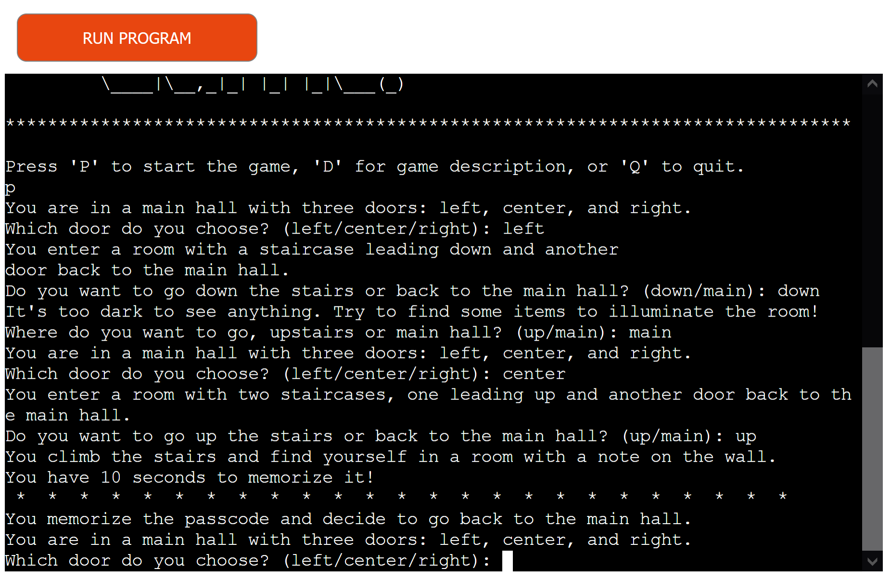
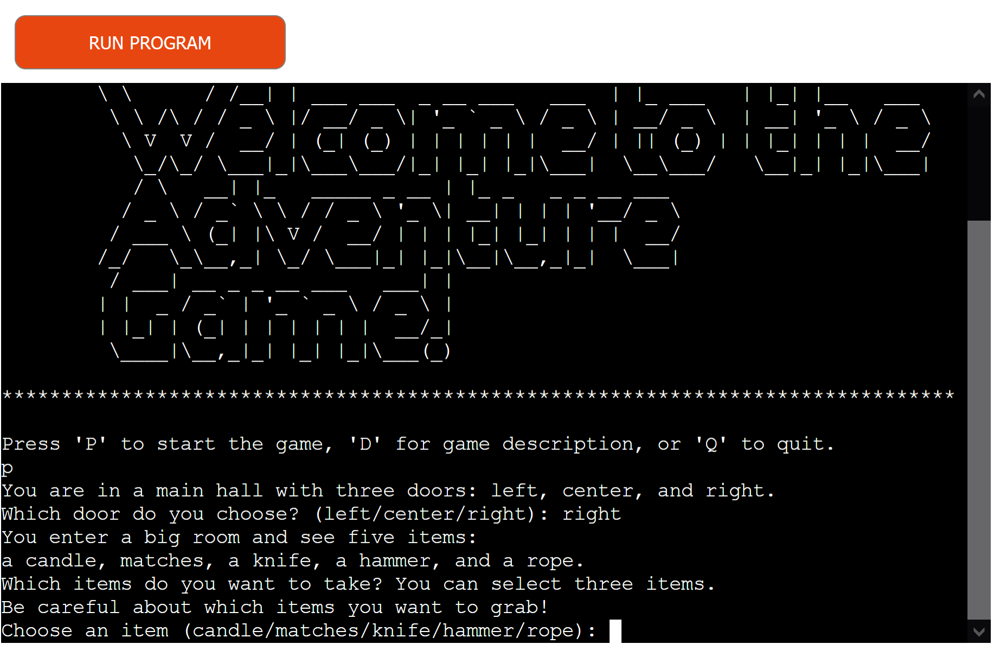
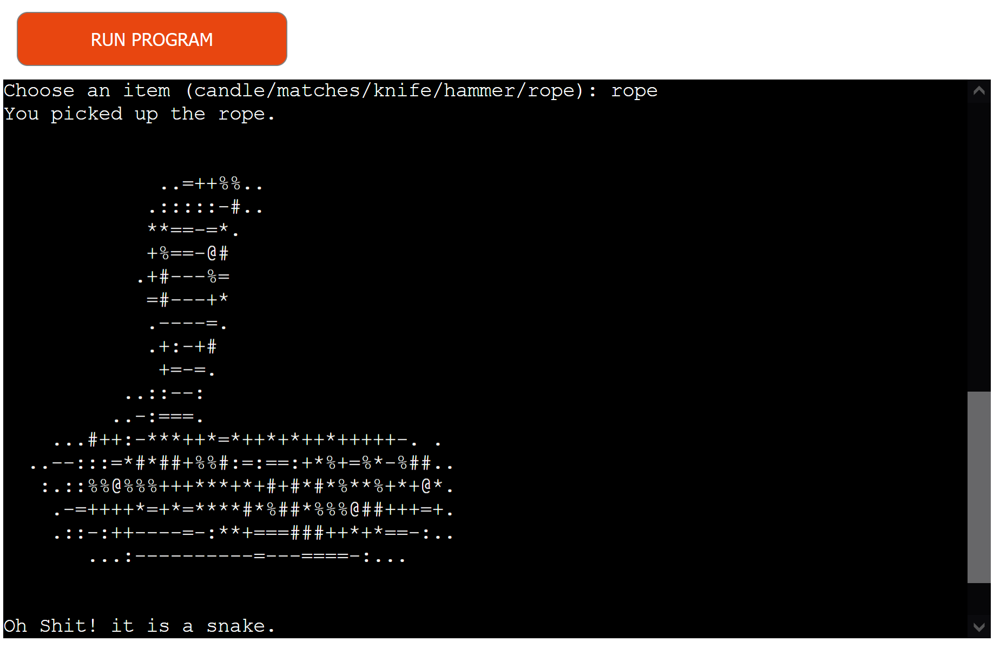
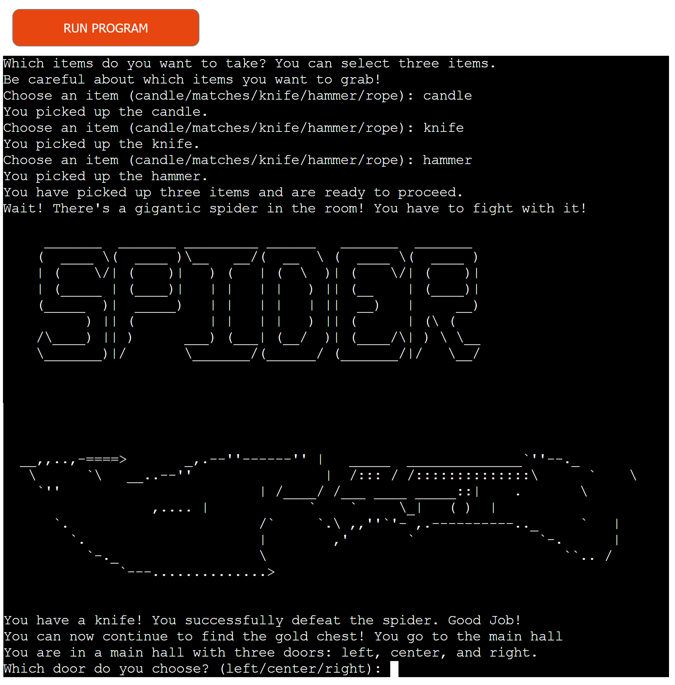
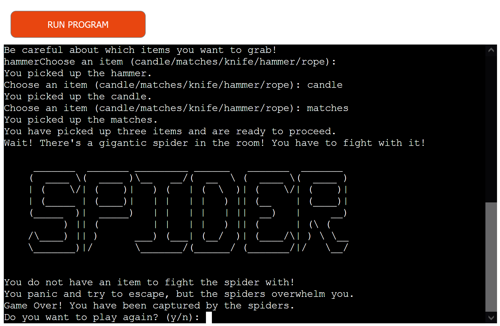

# Text-based Adventure Game 

Welcome to the Text-Based Adventure Game, an exciting and challenging adventure that will test your decision-making skills. In this game, you find yourself in a mysterious main hall with three doors leading to different adventures.

The live link can be found here - <https://adventure-game-python-59a69fd7bf52.herokuapp.com>

- __Your Mission__:

    - Explore various rooms, each with its unique challenges.
    - Find items to advance through the game.
    - Discover the passcode to unlock a chest filled with treasure.
    - Make the right choices to survive and complete your quest.

- __Key Features__:

    - A thrilling narrative that immerses you in the game's world.
    - Engaging challenges that require critical thinking.
    - Multiple rooms and adventures to keep you entertained.

### Existing Features

- __The Main page__

  - On the main page, you'll find a welcome message and you can start playing by typing p, or read about the game by typing d. You can quit the game by type q.
  - The case (uppercase or lowercase) of the letters is insignificant.

- __The Description Page__
  
  - User can find information about the game here.
  - By typing b user can go back to the main page.
  

- __The Left Door__
  - When you type left, you go to the left door. Then you can go back to the main hall or go down stairs.
  - You need some item to light the room. If you have them the room will be lighted, otherwise you need to find the items.
  - You can go up stairs or to the main hall by typing up or main.

- __The Center Door__
  - In center door, the passcode will show and you have 10 sec to memorize it. After 10 sec the passcode will be replaced by * * * .
  - You can go back to the main hall by typing mian.

- __The Right Door__
  - Here you can see a list of five items. You can grab three of them by typing the name of the item one by one.
  - It is important which items you pick up.
  - If you pick up an item more than once or type other text you see an error message "Invalid choice. Either you already have this item or it's not one of the available options."

  - If you pick up the rope, you will bite by a snake and Game Over!
  - You can play again by typing y. Typing n means end the game.

  - After grabing three items, you face with a spider. You need a knife to fight with it. If you picked up a knife you can kill the spider, otherwise the spider will eat you and Game Over!

  
  
  

## Testing

- I have checked the website on different screen sizes and it works well.
- The webpage works well when I used Google chrome, Firefox, Opera, and Microsoft Edge web browsers.
- The outcome of the quiz is always correct and I tested different scenarios to confirm it.
- I confirm that the quiz questions are easy to read and the contrast is good enough.

### Validator Testing

- HTML
  - No errors were returned when passing through the official W3C Markup Validator [W3C_validator](https://validator.w3.org/).
- CSS
  - No errors were found when passing through the official W3C CSS Validator [Jigsaw validator](https://jigsaw.w3.org/) .
- Javascript
  - No errors were found when passing through the official Jshint Validator [JSHint](https://jshint.com/).

- The Google Chrome lighthouse tool was used to check the website:
  - 

### Fixed Bugs

- When a user refreshed the page the scores in the table did not clean. Using localStorage.removeItem("quizScores") solved the isuue.
- The songs did not start from 0 second when a user restarted the quiz. Using happyMusic.currentTime = 0; sadMusic.currentTime = 0 in resetQuiz() function solved the isuue.

## Deployment

- GitHub pages
  - The site was deployed to GitHub pages. The steps to deploy are as follows:
    - In the GitHub repository, navigate to the Settings tab
    - From the source section drop-down menu, select the Master Branch
    - Once the master branch has been selected, the page will be automatically refreshed with a detailed ribbon display to indicate the successful deployment.

The live link can be found here - <https://teman67.github.io/Project_2/index.html>

- Local Clone
  - Log in to GitHub and locate GitHub Repository Project_2 [Project 2](https://github.com/teman67/Project_2)
  - Click on the code button, select clone with HTTPS, SSH or GitHub CLI and copy the link shown.
  - Open Git Bash
  - Change the current working directory to the location where you want the cloned directory to be made.
  - Type git clone and then paste The URL copied in the step 2.
  - Press Enter and your local clone will be created.

### Content

- The image of the quiz page was tooken from google images.
- The chicken icons were downloaded from google with .gif extention and then converted to .mp4 to reduce the size.
- The songs were downloaded from [Pixabay](https://pixabay.com).
- The Fisher-Yates algorithm to shuffle the questions was obtained from [Fisher-Yates Shuffle Algorithm](https://saturncloud.io/blog/how-to-randomize-shuffle-a-javascript-array/)
- The Readme.md template was obtained from Code Institute [Code Institute](https://github.com/Code-Institute-Org/ci-full-template).
