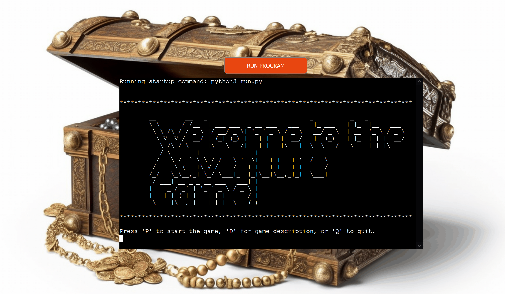

# Text-based Adventure Game 

Welcome to the Text-Based Adventure Game, an exciting and challenging adventure that will test your decision-making skills. In this game, you find yourself in a mysterious main hall with three doors leading to different adventures.

The live link can be found here - <https://adventure-game-python-59a69fd7bf52.herokuapp.com>

- __Your Mission__:

    - Explore various rooms, each with its unique challenges.
    - Find items to advance through the game.
    - Discover the passcode to unlock a chest filled with treasure.
    - Make the right choices to survive and complete your quest.

- __Key Features__:

    - A thrilling narrative that immerses you in the game's world.
    - Engaging challenges that require critical thinking.
    - Multiple rooms and adventures to keep you entertained.

### Existing Features

- __The Main page__

  - On the main page, you'll find a welcome message and you can start playing by typing p, or read about the game by typing d. You can quit the game by type q.
  - The case (uppercase or lowercase) of the letters is insignificant.

- __The Description Page__
  
  - User can find information about the game here.
  - By typing b user can go back to the main page.
  

- __The Left Door__
  - When you type left, you go to the left door. Then you can go back to the main hall or go down stairs.
  - You need some item to light the room. If you have them the room will be lighted, otherwise you need to find the items.
  - You can go up stairs or to the main hall by typing up or main.

  - If you have candle and matches you can light the room and see the chest gold.
  - Then you need a passcode to open the chest. If you enter the correct passcode then the chest will be opened and you win the game.

  

- __The Center Door__
  - In center door, the passcode will show and you have 10 sec to memorize it. After 10 sec the passcode will be replaced by * * * .
  - You can go back to the main hall by typing mian.

- __The Right Door__
  - Here you can see a list of five items. You can grab three of them by typing the name of the item one by one.
  - It is important which items you pick up.
  - If you pick up an item more than once or type other text you see an error message "Invalid choice. Either you already have this item or it's not one of the available options."

  - If you pick up the rope, you will bite by a snake and Game Over!
  - You can play again by typing y. Typing n means end the game.

  - After grabing three items, you face with a spider. You need a knife to fight with it. If you picked up a knife you can kill the spider, otherwise the spider will overwhelm you and Game Over!

  
  

## Testing

- Users should type valid text to continue the game. Otherwise, they see the error messages.
- The game was tested on Anaconda and Heroku Terminal.
- No error when the code was passed through the PEP8 <https://pep8ci.herokuapp.com>.
- I have checked different scenarios of the game and confirm that all of them work correctly.

## Fixed Bugs

- When a user was captured by snake or spider and select y to play again, the picked up items from right door did not remove from the selection list. Adding:
  - has_candle = False
  - has_matches = False
  - has_knife = False
  - has_hammer = False
  - has_rope = False 
to the right_door function solved the bug.  

## Deployment

- I followed the steps written below to deploy my project to [Heroku](https://heroku.com/), based on the [Code Institute](https://codeinstitute.net) instructions:

    - First created a Heroku account by flollowing the instructions given from Code Institute.

    - used the pip3 freeze > requirements.txt command to install our dependencies to Heroku.

    - Commit changes push the changes to Github: git commit -m "Add requirements for deployment”

    - In HEROKU after creating the account:

    - "Create new App".

    - Give the App a unique name and enter region.

    - Click on "Create App".

    - Click on "Settings" on your new App Dashboard.

    - Scroll down to Config Vars to add creds.json files and KEY: PORT and VALUE: 8000 for the deployment.

    - Press Add-button.

    - Scroll down to Buildpacks and press the icon for Python, click Save Changes, then press the icon for Nodejs and save changes. These Buildpacks need to be in the same order as below:

        - Python
        - NodeJS
    - Go to Deploy section tab and scroll down to the Deployment Method. Connect to Github pages and then could search for my Github Repository "Project_3" and then click connect.

    - Scroll down to Manual Deploys sections, then press Deploy Branch.

    - After the project has been deployed successfully I clicked the View-button to see the program run in the terminal.

### Content

- The template of the Readme file was obtained from [Code institute](https://github.com/Code-Institute-Org/python-essentials-template).
- The ASCII arts were generated by [ASCII ART](https://www.asciiart.eu/text-to-ascii-art).
- Styling of the display background and positioning of terminal were obtained from : [battleships](https://github.com/dnlbowers/battleships/blob/main/views/layout.html).